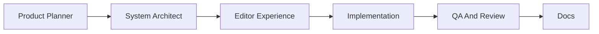
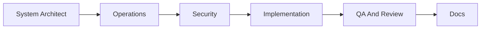
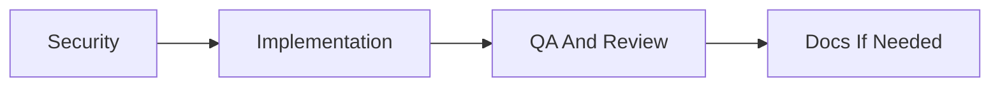
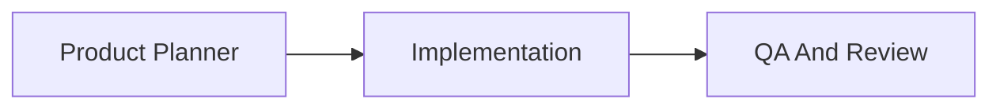

# Agents And Workflows

## Purpose

This project can use specialized agents as repeatable roles. An agent is not a separate service in the app. It is a development workflow role with a focused checklist, inputs, outputs, and quality gates.

Use these agents to keep future work organized and avoid mixing product design, implementation, testing, and operations in one blurry task.

## Agent Operating Rules

- One agent owns one type of concern.
- Every agent starts by reading the relevant docs and affected files.
- Every agent produces a concrete artifact: code, docs, review notes, test results, or an operations checklist.
- Agents should not silently skip verification.
- When a change is pushed, include the commit hash in the handoff.

## Core Agents

### 1. Product Planner Agent

Use when:

- A feature request is still vague.
- The workflow needs to be redesigned.
- Tradeoffs need to be made before coding.

Inputs:

- User problem.
- Existing docs.
- Screenshots or browser observations.
- Current constraints.

Outputs:

- Problem statement.
- Scope.
- Non-goals.
- User workflow.
- Milestones.
- Acceptance criteria.

Quality gate:

- The plan must name affected modules and testing needs.

### 2. System Architect Agent

Use when:

- A feature touches multiple modules.
- Data model changes are likely.
- A new service or integration is being considered.

Inputs:

- Product plan.
- `docs/architecture.md`.
- Prisma schema.
- Relevant source files.

Outputs:

- Architecture decision.
- Module boundaries.
- Data model proposal.
- API contract.
- Migration plan.
- Rollback considerations.

Quality gate:

- The proposal must avoid unnecessary abstraction and explain why the chosen design fits the current project.

### 3. Editor Experience Agent

Use when:

- Improving article writing.
- Changing Markdown/rich-text behavior.
- Adding media insertion, autosave, preview, or revision history.

Inputs:

- `docs/editor-redesign.md`.
- Current `PostForm`.
- Markdown renderer.
- Upload route.

Outputs:

- Editor workflow spec.
- Component plan.
- Interaction states.
- Test plan for writing, upload, preview, save, and publish.

Quality gate:

- The editor must protect against losing content.
- The public rendering must match the final preview.

### 4. Implementation Agent

Use when:

- The plan is clear enough to code.

Inputs:

- Product plan.
- Architecture notes.
- Existing code.

Outputs:

- Focused code changes.
- Tests.
- Updated docs when needed.

Quality gate:

- `npm run lint`
- `npm test`
- `npm run build`
- Additional E2E for UI changes

### 5. QA And Review Agent

Use when:

- A change is ready for review.
- The user asks what is still not good enough.
- A regression is suspected.

Inputs:

- Git diff.
- Test results.
- Relevant user workflows.

Outputs:

- Findings ordered by severity.
- Reproduction steps.
- Missing tests.
- Residual risks.

Quality gate:

- Findings must include file and line references when possible.
- If no issues are found, state remaining risk clearly.

### 6. Operations Agent

Use when:

- Docker, deployment, backups, environment variables, or GitHub Actions change.
- Preparing production deployment.

Inputs:

- `docs/operations.md`.
- `docker-compose.yml`.
- `.github/workflows/*`.
- Environment templates.

Outputs:

- Deployment checklist.
- Environment variable checklist.
- Backup/restore checklist.
- Health check results.

Quality gate:

- Verify `/api/ready`.
- Confirm rollback or restore path for production work.

### 7. Security Agent

Use when:

- Authentication, uploads, comments, admin APIs, dependencies, or headers change.

Inputs:

- Auth code.
- Middleware.
- Route handlers.
- `npm audit`.
- Environment templates.

Outputs:

- Threat notes.
- Required mitigations.
- Audit result.
- Follow-up tasks.

Quality gate:

- `npm audit --audit-level=moderate` must pass.
- Admin-only routes must enforce authentication.

### 8. Docs Agent

Use when:

- A feature needs documentation.
- The system direction changes.
- Future contributors need handoff notes.

Inputs:

- Code diff or plan.
- Existing docs.

Outputs:

- Updated docs.
- Cross-links from `docs/README.md`.
- Clear commands and checklists.

Quality gate:

- Docs must match actual filenames, routes, and commands.

## Recommended Workflow By Task Type

### Editor Redesign



### Production Deployment



### Dependency Security Fix



### Small UI Improvement



## Agent Handoff Template

Use this template when one workflow role hands off to the next:

```md
## Context

- User problem:
- Current state:
- Constraints:

## Decisions

- Decision 1:
- Decision 2:

## Changed Files

- `path/file`:

## Verification

- `npm run lint`:
- `npm test`:
- `npm run build`:
- `npm run e2e`:
- `npm audit --audit-level=moderate`:

## Risks

- Risk 1:

## Next Agent

- Recommended agent:
- Reason:
```

## Workflow Backlog

- Add PR template aligned with these agents.
- Add issue templates for feature, bug, operations, and security work.
- Add an editor redesign tracking document once implementation begins.
- Add release notes template after production deployment.
