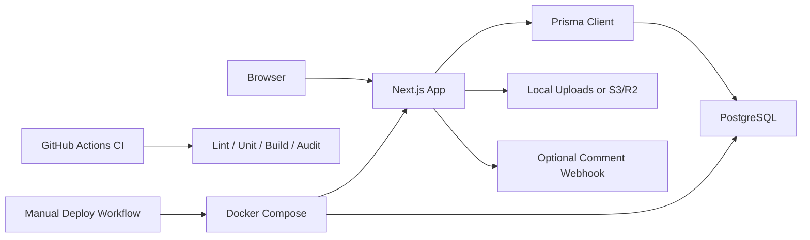

# Architecture

## Overview

Silas Blog is a server-rendered Next.js application backed by PostgreSQL. Prisma owns database schema, migrations, and typed data access. Docker Compose runs the app, database, migrations, seed jobs, AI indexing, and optional Caddy proxy.

## Runtime Components

| Area | Responsibility | Main Files |
| --- | --- | --- |
| Public blog | Home, post detail, search, archive, tags, about, RSS, sitemap | `src/app/*`, `src/components/post-card.tsx` |
| Admin | Login, post CRUD, comment management, stats | `src/app/admin/*`, `src/app/admin/actions.ts` |
| Content rendering | Markdown rendering, TOC, code highlighting/copy | `src/components/markdown-content.tsx`, `src/lib/markdown.ts` |
| Comments | Validation, moderation, rate limits, notifications | `src/app/blog/actions.ts`, `src/lib/comments.ts`, `src/lib/security.ts`, `src/lib/notifications.ts` |
| Uploads | Image validation, local upload, S3/R2-compatible upload | `src/app/api/admin/uploads/route.ts`, `src/lib/uploads.ts`, `src/lib/storage.ts` |
| Search | PostgreSQL full-text search with fallback query behavior | `src/lib/search.ts`, `src/app/search/page.tsx` |
| Analytics | Page views, daily post views, admin stats | `src/lib/analytics.ts`, `src/app/admin/stats/page.tsx` |
| AI retrieval | Article chunk index and `/ask` retrieval | `src/lib/ai-search.ts`, `ops/rebuild-ai-index.mjs`, `src/app/ask/page.tsx` |
| Operations | Health, readiness, backup, restore, retention | `src/app/api/health`, `src/app/api/ready`, `ops/*` |

## Data Model

Important Prisma models:

- `Post`: articles, publication state, tags, cover image, view count.
- `Comment`: public comments with approval state.
- `LoginAttempt`: admin login audit and rate-limit source.
- `PageView`: raw page view events.
- `DailyPostView`: aggregated per-post daily view counts.
- `AiDocument`: chunked text index for `/ask` and future RAG work.

Schema changes must go through Prisma migrations in `prisma/migrations`.

## Request Flows

### Article View

1. `src/app/blog/[slug]/page.tsx` loads a published post and approved comments.
2. `recordPostView` increments `Post.viewCount`.
3. A `PageView` event is written.
4. `DailyPostView` is upserted for current UTC day.
5. Markdown content renders through `MarkdownContent`.

### Comment Submission

1. `CommentForm` submits to `createCommentAction`.
2. `parseCommentFormData` trims and validates fields.
3. Honeypot, length, rate-limit, and blocklist checks run.
4. Comment is created as approved or pending depending on moderation and blocklist state.
5. Optional webhook notification is sent.
6. The article path is revalidated.

### Admin Login

1. Login page posts username/password to `loginAction`.
2. `isLoginLocked` checks recent failed attempts.
3. `verifyAdminCredentials` checks `ADMIN_USERS`.
4. Success writes an HTTP-only signed session cookie.
5. Failure records `LoginAttempt` and redirects with an error.

### Image Upload

1. Admin-only upload route checks authentication.
2. File MIME type, size, and magic bytes are validated.
3. If `STORAGE_DRIVER=local`, file is written to `public/uploads`.
4. If `STORAGE_DRIVER=s3`, file is uploaded with S3-compatible `PutObject`.
5. Route returns a public URL.

## Security Posture

- Admin routes require a signed HTTP-only cookie.
- Production public deployments should change `ADMIN_USERS`, `ADMIN_SECRET`, and database password.
- Security headers are configured in `next.config.ts`.
- Admin routes include `X-Robots-Tag: noindex, nofollow`.
- Uploads are restricted by MIME type, file size, and magic bytes.

## Design Boundaries

- Keep reusable business logic in `src/lib/*`.
- Keep route handlers and server actions thin.
- Prefer Prisma migrations over ad hoc database changes.
- Keep Docker jobs explicit: app, migrate, seed, ai-index.
- Treat `/ask` as retrieval-first today; full RAG should extend the index rather than replace it.

