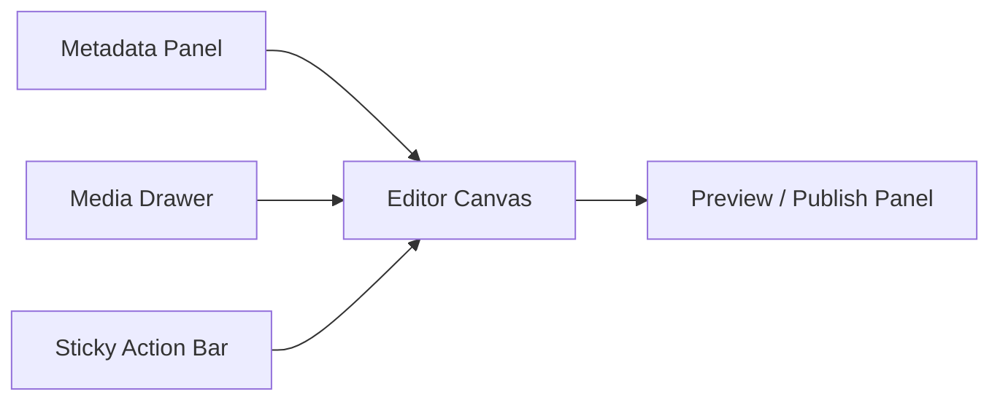

# Post Studio Open Source Implementation Spec

## Purpose

This document turns the editor redesign idea into a practical development spec. It borrows product patterns from mature open source CMS/editor projects, but the implementation should be written for this codebase instead of copying source code.

Reference projects and docs:

- MDXEditor: Markdown/MDX editor with plugins, toolbar, links, images, tables, code blocks, directives, frontmatter, and Next.js client-only integration.
- Keystatic document field: rich document field with formatting, links, images, layouts, tables, dividers, and component blocks.
- TinaCMS rich text field: Markdown-backed rich editing with configurable templates and content blocks.
- Decap CMS markdown widget: Markdown editor with rich text mode, image widget, and code block component ideas.
- Payload CMS rich text: Lexical-based rich editing pattern with configurable editor features.

The goal is to build our own private Post Studio around the same proven product ideas:

- structured article metadata
- comfortable rich Markdown writing
- media insertion and media management
- safe draft flow
- explicit publish flow
- preview and validation before publishing

## Non-Goals

- Do not copy code from open source repositories.
- Do not switch the whole app to a CMS product.
- Do not migrate away from PostgreSQL and Prisma.
- Do not store content in Git files for now.
- Do not introduce MDX custom components into public rendering until security and rendering rules are defined.

## Core Product Decision

Keep Markdown as the canonical stored content format.

Reasons:

- The current `Post.content` field already stores Markdown.
- Markdown is portable and easy to migrate.
- Public rendering already uses a Markdown renderer.
- Article backups remain readable outside the app.
- Editor engines can be swapped behind a wrapper later.

The Post Studio may provide rich editing controls, but the saved output should remain Markdown until there is a strong reason to introduce JSON or MDX.

## Open Source Patterns To Adopt

### 1. MDXEditor Pattern

Adopt:

- Client-only editor wrapper for Next.js.
- Plugin-based editor setup.
- Insert-at-cursor APIs.
- Markdown shortcut support.
- Toolbar grouped by writing task.
- Built-in concepts for links, images, tables, code blocks, directives, and frontmatter.

Use in our app:

- Create a `MarkdownEditor` wrapper component.
- Keep editor engine hidden behind the wrapper.
- Start with the current editor, then evaluate replacing it with `@mdxeditor/editor`.
- Keep all image/link/code/table insertion APIs inside `MarkdownEditor`.

Do not adopt yet:

- Arbitrary MDX JSX rendering in public posts.
- Custom directives without a sanitization and rendering policy.

### 2. Keystatic Pattern

Adopt:

- Treat the article body as a document, not a textarea.
- Use configurable feature groups: formatting, links, images, tables, dividers, component blocks.
- Let images carry metadata such as caption or alt text.
- Think in blocks for richer content: quote, callout, section, image, code.

Use in our app:

- Add a `PostContentBlocks` concept at the UI level while still saving Markdown.
- Represent callouts as Markdown directives or blockquote syntax first.
- Add image metadata through the media library.

Do not adopt yet:

- A full Markdoc/MDX schema system.
- Nested custom component blocks in the first implementation pass.

### 3. TinaCMS Pattern

Adopt:

- Markdown-backed rich editing.
- Templates for reusable blocks.
- Clear separation between schema fields and editor UI.
- Optional visual editing controls without losing source portability.

Use in our app:

- Add reusable insert templates:
  - note
  - warning
  - code example
  - two-column comparison table
  - resource link list
- Keep post metadata schema explicit in Prisma and form validation.

Do not adopt yet:

- Full external CMS schema runtime.
- Git-backed editorial workflow.

### 4. Decap CMS Pattern

Adopt:

- Markdown editor can support both raw and rich modes.
- Image and code block widgets should be first-class.
- Editorial workflow can separate draft/review/published states.

Use in our app:

- Add editor mode tabs: write, split preview, final preview.
- Add code block insertion with language selector.
- Add image widget UI with upload/select/alt/caption.
- Later add post status states beyond boolean `published`.

Do not adopt yet:

- Multi-user review workflow unless the blog needs more editors.

### 5. Payload/Lexical Pattern

Adopt:

- Feature-based editor configuration.
- Floating toolbar and slash command ideas.
- Structured rich blocks as a future option.

Use in our app:

- Add a slash menu later:
  - `/image`
  - `/code`
  - `/table`
  - `/note`
  - `/link`
- Keep this behind the `MarkdownEditor` abstraction.

Do not adopt yet:

- Lexical JSON storage.
- Complex rich text schema migration.

## Target Post Studio Layout

The create/edit page should become a three-zone workspace.



### Header / Sticky Action Bar

Content:

- post status
- dirty state
- autosave state
- save draft
- publish
- unpublish
- preview
- back to list

Behavior:

- Always visible while scrolling.
- `Ctrl+S` triggers save draft.
- Publish requires checklist pass.
- Unsaved changes trigger leave warning.

### Metadata Panel

Fields:

- title
- slug
- excerpt
- tags
- cover image
- SEO title
- SEO description
- canonical URL optional

Behavior:

- Slug auto-generates from title until manually edited.
- Slug uniqueness validates before publish.
- SEO description can default from excerpt.
- Cover image can be selected from media library.

### Editor Canvas

Capabilities:

- rich Markdown writing
- source Markdown fallback
- link insertion dialog
- code block language picker
- table insert
- callout insert
- image insert
- drag-and-drop image upload
- paste image upload
- keyboard shortcuts

### Media Drawer

Capabilities:

- upload new image
- list uploaded assets
- search/filter assets
- show thumbnail
- copy URL
- insert into content
- set as cover
- edit alt text
- edit caption

### Preview / Publish Panel

Capabilities:

- final article preview
- publish checklist
- broken image warning
- missing metadata warning
- public preview link
- revision summary later

## Data Model Plan

### Immediate

Use existing `Post` model.

No migration required for the first UI refactor.

### Next Migration: Media Library

Add `MediaAsset`.

```prisma
model MediaAsset {
  id          String   @id @default(cuid())
  url         String   @unique
  filename    String
  mimeType    String
  size        Int
  width       Int?
  height      Int?
  alt         String?
  caption     String?
  storageKey  String?
  createdAt   DateTime @default(now())
  updatedAt   DateTime @updatedAt
}
```

### Next Migration: Server Autosave

Add `DraftAutosave`.

```prisma
model DraftAutosave {
  id        String   @id @default(cuid())
  postId    String?
  clientId  String
  payload   Json
  createdAt DateTime @default(now())
  updatedAt DateTime @updatedAt
}
```

### Future Migration: Revision History

Add `PostRevision`.

```prisma
model PostRevision {
  id        String   @id @default(cuid())
  postId    String
  title     String
  slug      String
  excerpt   String
  content   String
  coverImage String?
  tags      String[]
  published Boolean
  createdAt DateTime @default(now())
  author    String?
  post      Post     @relation(fields: [postId], references: [id], onDelete: Cascade)
}
```

## API Plan

| Endpoint | Method | Purpose |
| --- | --- | --- |
| `/studio-api/uploads` | `POST` | Upload image. Existing route. |
| `/studio-api/media` | `GET` | List uploaded media. |
| `/studio-api/media` | `POST` | Create media metadata after upload if needed. |
| `/studio-api/media/:id` | `PATCH` | Update alt/caption. |
| `/studio-api/drafts/autosave` | `POST` | Save server draft. |
| `/studio-api/drafts/recover` | `GET` | Recover draft by post/client. |
| `/studio-api/posts/:id/preview-token` | `POST` | Generate unpublished preview token. |
| `/studio-api/posts/:id/revisions` | `GET` | List revisions. |
| `/studio-api/posts/:id/revisions/:revisionId/restore` | `POST` | Restore revision. |

All routes must:

- require admin session
- use configured hidden API path
- validate inputs
- return typed JSON
- be covered by focused tests

## Component Plan

Create these components over time:

| Component | Purpose |
| --- | --- |
| `PostEditorShell` | Main workspace layout and sticky action bar |
| `PostMetadataPanel` | Title, slug, excerpt, tags, cover, SEO |
| `MarkdownEditor` | Editor engine wrapper |
| `EditorToolbar` | App-owned command toolbar |
| `MediaDrawer` | Gallery, upload, select, metadata |
| `MediaAssetCard` | Thumbnail, insert, set cover, edit metadata |
| `PublishPanel` | Status, checklist, publish/unpublish |
| `PreviewPane` | Final public rendering |
| `DraftStatus` | Autosave and dirty-state display |
| `RevisionDrawer` | Revision history and restore |

## Implementation Sequence

### Step 1: Component Extraction

Goal:

- Keep behavior unchanged.
- Split current `PostForm` into smaller components.

Files:

- `src/components/post-editor-shell.tsx`
- `src/components/post-metadata-panel.tsx`
- `src/components/markdown-editor.tsx`
- `src/components/preview-pane.tsx`

Acceptance:

- Existing editor workflow still passes E2E.
- No database migration.

### Step 2: Publish Panel

Goal:

- Replace boolean checkbox with explicit actions and checklist.

Features:

- save draft
- publish
- unpublish
- show checklist
- show current status

Acceptance:

- User understands whether a post is draft or public.
- Publishing cannot happen with missing title, slug, excerpt, or content.

### Step 3: Media Library Foundation

Goal:

- Turn uploaded images into reusable assets.

Features:

- `MediaAsset` model
- list media route
- media drawer
- set as cover
- insert into article
- alt/caption fields

Acceptance:

- User can reuse an uploaded image without uploading again.

### Step 4: Server Autosave

Goal:

- Drafts survive browser/device changes.

Features:

- autosave route
- recovery route
- save state
- conflict handling

Acceptance:

- User can close browser and recover work after reopening.

### Step 5: Editor Engine Evaluation

Goal:

- Decide whether to keep `@uiw/react-md-editor` or migrate to `MDXEditor`.

Evaluation criteria:

- Next.js App Router compatibility
- image upload support
- table editing quality
- code block UX
- toolbar customizability
- bundle impact
- Markdown compatibility with current renderer

Acceptance:

- Decision record added to docs.
- Prototype branch or isolated component validates the chosen editor.

### Step 6: Revision History

Goal:

- Make edits reversible.

Features:

- save revision on publish and major save
- revision drawer
- compare metadata and content summary
- restore revision

Acceptance:

- User can restore a previous post version safely.

## UI Acceptance Checklist

The new Post Studio is acceptable when:

- Creating a post does not feel like filling a raw database form.
- Common CSDN/Juejin-style actions are discoverable.
- Images can be uploaded, selected, inserted, and previewed.
- Code blocks can choose language.
- Links can be inserted without remembering Markdown syntax.
- Drafts cannot be lost silently.
- Publish state is explicit.
- Final preview matches public rendering.

## Engineering Acceptance Checklist

- Editor engine is wrapped and replaceable.
- No admin API is public without authentication.
- Tests cover create/edit/upload/helper buttons.
- `npm run lint` passes.
- `npm test` passes.
- `npm run build` passes.
- `npm run e2e` passes for UI changes.
- `npm audit --audit-level=moderate` passes.

## Source References

- MDXEditor documentation: https://mdxeditor.dev/editor/docs/getting-started
- Keystatic document field: https://keystatic.com/docs/fields/document
- TinaCMS rich text field: https://tina.io/docs/reference/types/rich-text
- Decap CMS markdown widget: https://decapcms.org/docs/widgets/markdown/
- Payload CMS rich text: https://payloadcms.com/docs/rich-text/overview
